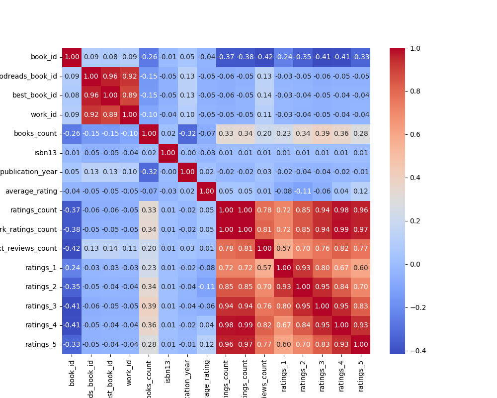

# Dataset Analysis Report
## Data Summary
```
           book_id  goodreads_book_id  best_book_id  ...      ratings_3     ratings_4     ratings_5
count  10000.00000       1.000000e+04  1.000000e+04  ...   10000.000000  1.000000e+04  1.000000e+04
mean    5000.50000       5.264697e+06  5.471214e+06  ...   11475.893800  1.996570e+04  2.378981e+04
std     2886.89568       7.575462e+06  7.827330e+06  ...   28546.449183  5.144736e+04  7.976889e+04
min        1.00000       1.000000e+00  1.000000e+00  ...     323.000000  7.500000e+02  7.540000e+02
25%     2500.75000       4.627575e+04  4.791175e+04  ...    3112.000000  5.405750e+03  5.334000e+03
50%     5000.50000       3.949655e+05  4.251235e+05  ...    4894.000000  8.269500e+03  8.836000e+03
75%     7500.25000       9.382225e+06  9.636112e+06  ...    9287.000000  1.602350e+04  1.730450e+04
max    10000.00000       3.328864e+07  3.553423e+07  ...  793319.000000  1.481305e+06  3.011543e+06

[8 rows x 16 columns]
```
## Insights from AI Analysis
Based on the provided dataset summary, here are some insights:

### General Overview:
- The dataset contains information about 10 books, including attributes like title, author, original publication year, language code, average rating, ratings count, and more.

### Key Insights:

1. **Most Popular Books (by Ratings Count)**:
   - **The Hunger Games** by Suzanne Collins: 4,780,653 ratings
   - **Harry Potter and the Philosopher's Stone** by J.K. Rowling: 4,602,479 ratings
   - **Twilight** by Stephenie Meyer: 3,866,839 ratings
   - These books are not only popular in terms of ratings but also amongst readers, as evidenced by their high ratings count.

2. **Average Ratings**:
   - The highest average rating among these books is **4.44** for **Harry Potter and the Philosopher's Stone**.
   - The lowest average rating is **3.57** for **Twilight**.
   - Most average ratings hover around the 4.0 mark, indicating that these are generally well-received books.

3. **Publishing Era**:
   - The books span a wide range of publication years, from **1813** (Pride and Prejudice by Jane Austen) to **2012** (The Fault in Our Stars by John Green).
   - This diversity illustrates a mix of classic literature and contemporary works.

4. **Text Reviews Count**:
   - **The Hunger Games** has the highest number of text reviews at **155,254**, indicating not only a large readership but also significant engagement from the audience.
   - In contrast, **Pride and Prejudice** has fewer text reviews (49,152), which is relatively low given its historical significance and reader base.

5. **Genre and Themes**:
   - The dataset reflects a variety of genres, including fantasy (Harry Potter, Twilight), classic literature (Pride and Prejudice, To Kill a Mockingbird), and contemporary fiction (The Fault in Our Stars).
   - The presence of both contemporary series and classic literature shows a broad appeal across different demographics and reader interests.

6. **Ratings Distribution**:
   - **The Hunger Games** shows a strong performance in 5-star ratings with **2,706,317** ratings, indicating a loyal fan base that highly appreciates the book.
   - The rating distribution suggests a common pattern where most readers tend to provide higher ratings for these popular books.

7. **Authors**:
   - Some authors, like J.K. Rowling and Suzanne Collins, have achieved massive popularity and high engagement with readers.
   - Notably, all authors in the dataset are well-known, highlighting the influence of established authors in attracting readership.

### Summary:
The dataset provides a snapshot of prominent books that have garnered significant attention and acclaim. Engaging storytelling and memorable characters seem to contribute to high ratings and reader interactions. The mix of classic and contemporary literature illustrates the lasting appeal of quality writing across generations. Further analysis could delve into specific reader demographics, trends over time, or even comparisons between different genres.
## Data Visualizations

