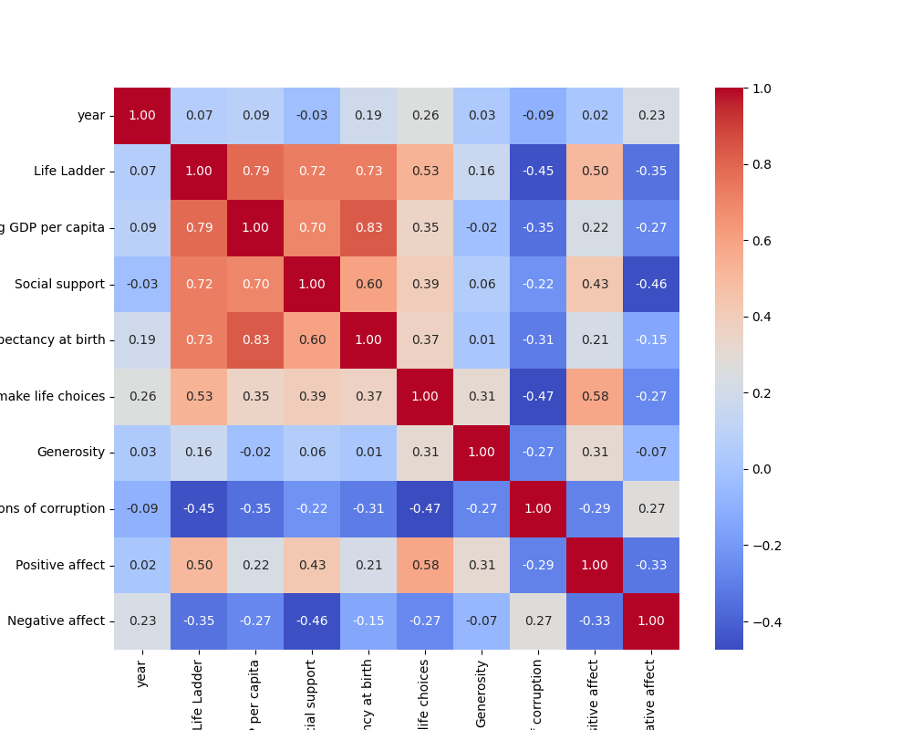

# Dataset Analysis Report
## Data Summary
```
              year  Life Ladder  Log GDP per capita  ...  Perceptions of corruption  Positive affect  Negative affect
count  2363.000000  2363.000000         2335.000000  ...                2238.000000      2339.000000      2347.000000
mean   2014.763860     5.483566            9.399671  ...                   0.743971         0.651882         0.273151
std       5.059436     1.125522            1.152069  ...                   0.184865         0.106240         0.087131
min    2005.000000     1.281000            5.527000  ...                   0.035000         0.179000         0.083000
25%    2011.000000     4.647000            8.506500  ...                   0.687000         0.572000         0.209000
50%    2015.000000     5.449000            9.503000  ...                   0.798500         0.663000         0.262000
75%    2019.000000     6.323500           10.392500  ...                   0.867750         0.737000         0.326000
max    2023.000000     8.019000           11.676000  ...                   0.983000         0.884000         0.705000

[8 rows x 10 columns]
```
## Insights from AI Analysis
Certainly! Let's analyze the provided dataset for Afghanistan from 2008 to 2017, focusing on various metrics that relate to overall life satisfaction (Life Ladder), economic stability (Log GDP per capita), social support, health, freedom, generosity, and perceptions of corruption.

### Trends Over the Years

1. **Life Ladder**:
   - The Life Ladder, which represents subjective well-being or life satisfaction, fluctuated significantly between 2008 and 2017. 
   - The highest recorded value was 4.758 in 2010, while the lowest was 2.662 in 2017. This indicates a downward trend over the years, particularly striking after 2015.

2. **Log GDP per capita**:
   - The log GDP per capita shows an overall upward trend, indicating a gradual economic improvement from 7.350 in 2008 to 7.648 in 2017. However, the increase is slight when compared to the fluctuations in the Life Ladder.

3. **Social Support**:
   - Social support scores experienced minimal fluctuation, hovering around the 0.5 mark, peaking at 0.559 in 2016. This suggests that despite economic and emotional instabilities, social support remained relatively consistent.

4. **Healthy Life Expectancy**:
   - Healthy life expectancy at birth showed a slow upward trend from 50.5 years in 2008 to 53.25 years in 2017. This may indicate gradual improvements in healthcare and living conditions, despite other declining factors.

5. **Freedom to Make Life Choices**:
   - This metric saw a notable decline from 0.718 in 2008 to 0.389 in 2015, highlighting a significant reduction in perceived personal freedoms. However, it appeared to stabilize afterwards showing a slight rebound in 2016.

6. **Generosity**:
   - Generosity scores fluctuated moderately, experiencing a notable fall to 0.059 in 2013. It demonstrated an upward trend again after 2013 but remained below its initial value.

7. **Perceptions of Corruption**:
   - Perceptions of corruption show a concerning trend, changing from 0.882 in 2008 to -0.123 in 2015. This drastic decline indicates growing discontent with governance and increasing perceptions of corruption.

8. **Positive and Negative Affect**:
   - **Positive Affect**: The average score varied slightly, reflecting some fluctuations, though people seemed to continue experiencing moments of positivity, with the highest score of 0.954 recorded in 2017.
   - **Negative Affect**: This score has risen from 0.258 in 2008 to 0.371 in 2017, indicating an increase in negative experiences, which correlates with the declining Life Ladder scores.

### Insights:

- **Declining Life Satisfaction**: The overall trend of declining life satisfaction (Life Ladder) despite some improvements in GDP and health indicates that economic growth has not translated into perceived happiness or well-being for Afghan citizens. Factors influencing this may include conflict, instability, and social issues.

- **Economic Growth vs. Life Quality**: While GDP is steadily increasing, the perceived quality of life as represented by Life Ladder is declining, indicating that economic improvements aren't sufficiently addressing the needs or challenges faced by the population.

- **Increased Negative Affect**: The rise in negative affect scores suggests a worsening overall emotional climate, which may be contributing to lower life satisfaction scores.

- **Importance of Social Support and Freedom**: Although social support remained consistent and healthy life expectancy has improved, the erosion of personal freedoms and increase in perceptions of corruption may further contribute to psychological stress and dissatisfaction.

### Recommendations for Improvement:

- **Strengthening Governance**: Improve transparency and fight against corruption to enhance trust in institutions.
- **Enhancing Social Support Systems**: Develop programs to strengthen community bonds and support initiatives that foster a sense of belonging and shared purpose.
- **Mental Health Initiatives**: Increase awareness and access to mental health resources to combat the rising negative affect scores and improve overall well-being.

In summary, while there are some positive indicators, the overall sentiment indicates significant challenges that need to be addressed to enhance the life satisfaction of the Afghan people.
## Data Visualizations

