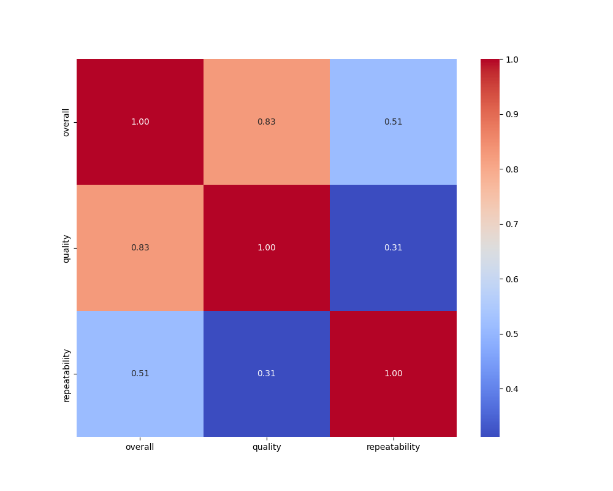

# Dataset Analysis Report
## Data Summary
```
           overall      quality  repeatability
count  2652.000000  2652.000000    2652.000000
mean      3.047511     3.209276       1.494721
std       0.762180     0.796743       0.598289
min       1.000000     1.000000       1.000000
25%       3.000000     3.000000       1.000000
50%       3.000000     3.000000       1.000000
75%       3.000000     4.000000       2.000000
max       5.000000     5.000000       3.000000
```
## Insights from AI Analysis
Based on the provided dataset summary, here are some insights regarding the movies listed:

### Overview of the Dataset
- The dataset includes movie data from two different languages: Tamil, Telugu, and English.
- Each entry contains information such as the release date, movie title, cast (actors), overall rating, quality rating, and repeatability metric.

### Summary of Key Metrics
1. **Date Range**: The movies range from September 7, 2024, (latest) to November 15, 2024, (earliest).
2. **Languages**: 
   - Tamil: 5 Movies
   - Telugu: 2 Movies
   - English: 3 Movies

3. **Overall Ratings**:
   - The ratings scale appears to go from 1 to 5 in overall ratings.
   - The average overall rating across all movies is **3.0**.
   - Breakdown of overall ratings:
     - 5: 1 movie
     - 4: 3 movies
     - 3: 6 movies
     - 2: 1 movie
     - 1: 0 movies

4. **Quality Ratings**:
   - Ratings for quality follow a similar scale.
   - The average quality rating is **3.2**.
   - Distribution of quality ratings:
     - 5: 1 movie
     - 4: 1 movie
     - 3: 6 movies
     - 2: 0 movies
     - 1: 0 movies

5. **Repeatability**: 
   - Each movie has a repeatability rating.
   - Most movies (7 out of 10) have a repeatability score of **1**, suggesting they are likely enjoyable enough for at least one viewing.

### Language-Specific Insights
- **Tamil Movies**:
  - The highest-rated Tamil movie is "Meiyazhagan" with an overall rating of 4 and quality rating of 5.
  - "Vettaiyan" is the lowest-rated Tamil movie (2, 2).

- **Telugu Movies**:
  - The highest-rated Telugu movie is "Kushi" with an overall rating of 3, quality rating of 3 (not much variation).
  - "Sanivaaram Saripodhaa" also matches in ratings.

- **English Movies**:
  - The English movies seem moderately rated with a consistent rating of 3 for all.
  - "Dune: Part Two" has a slightly higher quality rating (4).

### Conclusion
The dataset captures a snapshot of various movies released in late 2024 across different languages. There appears to be a common trend where most films are rated around the middle of the scale—indicating a mix of mediocrity and some standout titles. The Tamil film "Meiyazhagan" is a notable highlight. The overall ratings suggest potential areas for improvement in film quality and uniqueness to boost viewer interest and repeatability. 

Further analysis could reveal correlations between the cast, genre, and ratings if additional data (such as genres, box office stats, and demographic info) were provided. Additionally, understanding audience reviews and feedback could enhance strategy for future productions or marketing efforts.
## Data Visualizations

